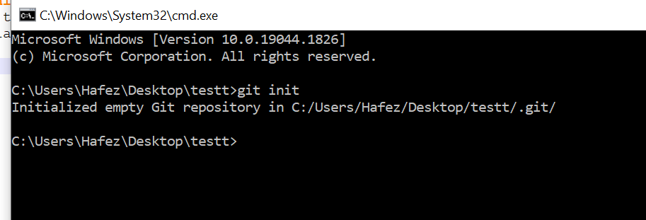
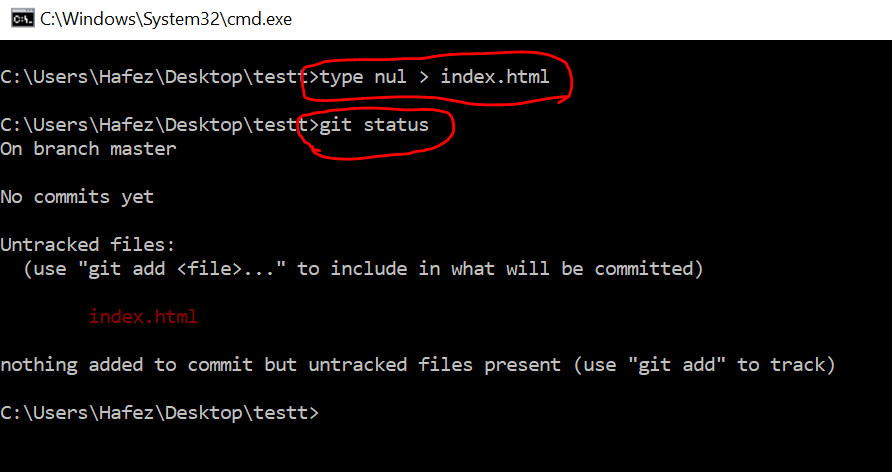
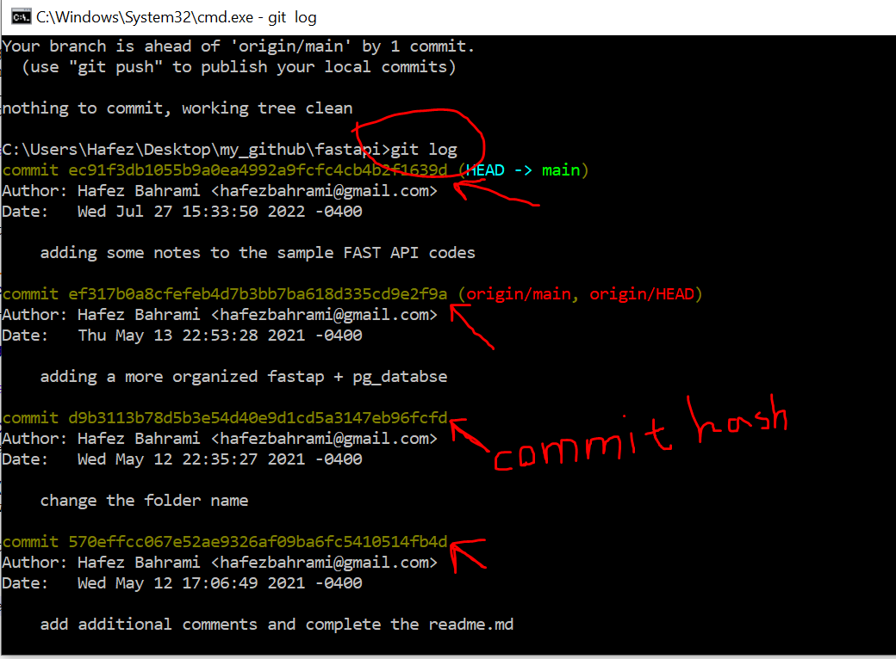

# How to work on git

# git init
If I go to specific folder in my local and "cmd" that local, and in cmd I type "**git init**" and run this command I will get the following 
response "Initialized empty Git repository in C:/Users/Hafez/Desktop/testt/.git/".
It initialized an empty repository in Git, and it will contain .git folder that includes all the files on handling the version controling in Git. No 
need to worry about ,git folder.

# git status
If I then in the same "cmd" type the "**git status**" command, it says no commit yet

# Small project
1) **creating the file**: Let's do a small project and create a file index.html
 in windows cmd: => "**type nul > index.html**". This command in Linux system would be "touch index.html"
 
2) **get the git status**: Now let's try "**git status**" in cmd.

3) **Commiting the changes**:There are two steps to commit a change: (a) We should decide what file/changes we want to add to staging step, and (b) from staging step we then commit
The reason for that is in large projects, you might have many changes that only few of them need to be commited.

step (a) above is by running the command: "**git add File_A File_B**". After running this command, we can also run the "**git status**" just to make sure
what we staged. 

for step (b), for the commiting staged changes" there are a few ways to do it. The simplest format is with using -m flag as: "**git commit -m "My-Own_Message_for_this_commit**".
-m is for the message.

now we can "**git log**" to get a history of commit. Each commitis identified by a commit-hash.

4) **git push**: Basically pushing a commited code located in the local repository into the remote repository (so we can see it in our github account).

# How to get back to some specific commit
Let's assume that we want to go back to a few checked-ins back. As we saw above with "**git log**" we get to see the history and log of changes for that specific
folder and each commit is shown with a _commit hash_. 

To go back to specific change, we use the commit hash that we got after running the "**git log**" command. We simply run "**git checkou COMMIT_HASH**".

# Branch
Branches in Git are like time-lines of our apllication in the repository. We can create branch at will. Let's assume we were working on one app for a year,
then I get a crazy idea on how I want to style it, **I might want to make a new branch** and name it as New_Style or ... I would do all crazy ideas (tests)
on this new branch rather than the main branch/code that everyone else in the team is working on.

### List of branches
**git branch** will give us the list of branches. 

### master Branch
The main branch that originall was created by default and we usually work on is the **master branch**. If we did the **git checkout <hash_number>** and went
to a specific change, we basically ctreated a new bracn (or we are a new branch off the master branch).

**git checkout master** will take us back to the master branch.

### create a new branch
**git branch NAME_OF_BRANCH** will create a new branch right off of wherever we are. now we can see all the branch available by **bit branch**.
To go to this new branch, **git checkout NAME_OF_BRANCH**, and if we assume we are in master, off the master branch
this new branch will be created and will be in this new branch. If we now **git status** it, we will see all the code in the master branch will be listed
as new changes that has not been staged and we can stage them all and ready to commit for this new branc named as NAME_OF_BRANCH. 

Let's assume we make changes. ALl these changes will be on this new branc: NAME_OF_BRANCH. Let's assume after a day I want to go back to
 master: **git checkout master**. Now if we do the **git status** we do not see any changes being made on new branch, we are good to start to start
 wherever we left off the master branch.
 
 # Merge
 Let assume we want to merge all the changes I made in the new branch noted above "NAME_OF_BRANCH" into the master branch, and basicallymake all the 
 codes identical. Let's assume we are in master, and we want to merge the NAME_OF_BRANCH changes into master. Then, we need to write:
 
 **git merge <name_of_branch_to_be_merged_to_current_branch>**
 
 for this example:
 **git merge NAME_OF_BRANCH**

