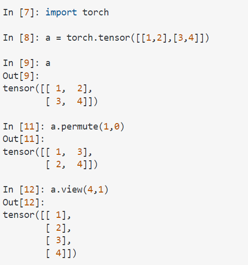

# Pytorch useful Commands

## 1 Essentials
#### 1-1 Change the doemntions of the tensor:
I) Permute:
src.shape = 10X12X30   ==> src.permute(1, 0 , 2) will swap the 0 and 1st dimention. SO, the src.shape afterward will be: 12X10X30

There is a difference between X.view(), X.permute(), X.reshape:

**X.view()** works on contiguous tensors, while **X.reshape** works on non-contigous tensors. **X.permute()** returns a view of the original 
tensor input with its dimensions permuted. It is quite different to view and reshape.

II) 

## 2 Seconadry
I) **contigous**: There are a few operations on Tensors in PyTorch that do not change the contents of a tensor, but change the way the data is 
organized. These operations include: narrow(), view(), expand() and transpose(). Example: **myTensor.view(10, 120).t().contiguous()**

II) difference between **nn.CrossEntropyLoss()** and Log-liklyhood-loss **nn.NLLLoss()** losses: If the model defined in a way that the there is
 a nn.Softmax(LOGITS) layer after the  logits-classifier layer, then we should use nn.NLLLoss. nn.CrossEntropyLoss is supposed to get the 
 logits of classifier layer and do the nn.Softmax itself.

